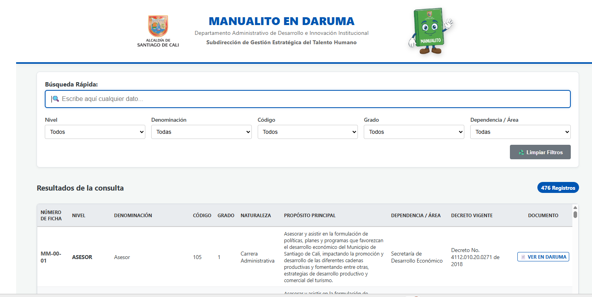
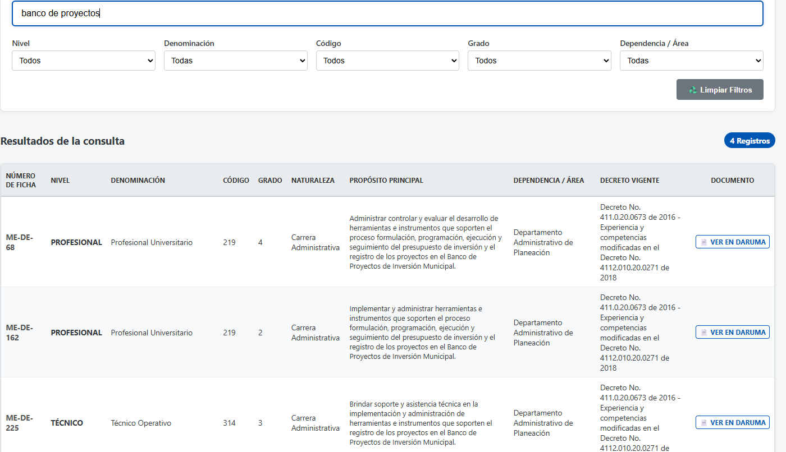

# 📋 Manualito en Daruma

**Herramienta de búsqueda y consulta de manuales de funciones para la Alcaldía de Santiago de Cali**

🔗 **Portal de Daruma (consulta pública)**: https://sig.cali.gov.co/app.php/staff/portal/tab/16

Desplegado en **abril de 2026**, "Manualito en Daruma" facilita la búsqueda de documentos — específicamente las fichas de descripción de funciones — dentro del módulo **Portal de Daruma** del sistema SIG (Sistema Integrado de Gestión) de la Alcaldía de Cali.


> 🇬🇧 **English summary below** — [Jump to English](#-english-summary) · [Full English README](README.en.md)

<!-- SCREENSHOTS -->


*Dashboard principal: filtros combinados (Nivel, Denominación, Código, Grado, Dependencia/Área) + búsqueda rápida. Tabla con 10+ resultados y botón "📄 Ver en Daruma".*



*Filtro de búsqueda rápida aplicado por texto libre. La tabla se actualiza en tiempo real mostrando solo coincidencias.*

---

## 🎯 Problema

El módulo **Portal de Daruma** del SIG de la Alcaldía de Cali permite consultar las fichas de descripción de funciones de los cargos públicos, pero:

- **No tiene búsqueda avanzada**: solo navegación manual por listados extensos
- **No permite filtros combinados** (por código, grado, dependencia, área, propósito)
- **Campo como "Decreto vigente" y "Nivel" no son campos de formulario** — están embebidos en el HTML de cada ficha, no en la API

Resultado: encontrar un manual de funciones específico requería abrir cada ficha una por una.

## ✅ Solución

"Manualito en Daruma" es una **web app construida sobre Google Apps Script** que:

1. **Inventaria automáticamente** todos los manuales de funciones via scraping
2. **Extrae campos no disponibles en la API** (decreto vigente, nivel, área funcional, propósito) directamente del HTML de cada ficha
3. **Expone una interfaz de búsqueda** con filtros combinados y búsqueda rápida por texto libre
4. **Se actualiza diariamente a las 4:00 AM** de forma automática e incremental

## 🏗️ Arquitectura

```
┌─────────────────────────────────────────────────┐
│              Google Spreadsheet                  │
│  ┌──────────┐    ┌──────────────────────────┐  │
│  │ Hoja     │    │ Hoja "Informe"           │  │
│  │ "Datos"  │    │ (28 columnas + URL)      │  │
│  │ (API)    │    │ (API + Scraping HTML)    │  │
│  └────┬─────┘    └──────────┬───────────────┘  │
│       │                     │                   │
│       ▼                     ▼                   │
│  ┌────────────────────────────────────────┐    │
│  │     Apps Script (Code.gs + Index.html) │    │
│  │  • Script de scraping (batch/concurrent)│   │
│  │  • Web App doGet() → Index.html        │    │
│  │  • Trigger diario 4:00 AM              │    │
│  └────────────────────────────────────────┘    │
└─────────────────────────────────────────────────┘
         │
         ▼
┌─────────────────────────────────────────────────┐
│       Interfaz web (Index.html)                  │
│  • Búsqueda rápida (texto libre)                 │
│  • Filtros: Nivel, Denominación, Código,         │
│    Grado, Dependencia/Área, Propósito            │
│  • Tabla con hasta 500 resultados                │
│  • Link directo a cada ficha en Daruma           │
└─────────────────────────────────────────────────┘
```

## 🔧 Cómo funciona

### 1. Sincronización con la API de SIG Cali

El script consulta la API oficial del SIG (`sig.cali.gov.co/api.php/staff/v2/QueryManualFunciones`) para obtener el inventario completo de manuales de funciones. Los datos se guardan en la hoja **"Datos"** del spreadsheet.

### 2. Web scraping de cada ficha

Muchos campos importantes (**Decreto vigente**, **Nivel**, **Área funcional**, **Propósito principal**, **Funciones**, **Conocimientos básicos**) **no vienen en la API** — están embebidos en el HTML de cada ficha de Daruma.

El script hace **fetch HTTP de cada ficha**, parsea el HTML con expresiones regulares y extrae esos campos. Para evitar timeouts de Apps Script:

- **Procesamiento en lotes** de 40 fichas (`BATCH_SIZE = 40`)
- **Concurrencia** de 5 requests simultáneos (`CONCURRENCY = 5`)
- **Triggers encadenados** (`timeBased().after(3000)`) que re-ejecutan la función cada 3 segundos sin agotar el límite de ejecución de Apps Script
- **Reintentos con backoff exponencial** para errores 502/504
- **Actualización incremental**: solo scrapea fichas nuevas o modificadas (compara `fecha_de_modificacion`)

### 3. Web App (Frontend)

Se despliega como **Web App de Google Apps Script** (`doGet()` → `Index.html`). La interfaz:

- Carga datos cacheados desde la hoja "Informe" vía `google.script.run`
- Filtros por **Nivel, Denominación, Código, Grado, Dependencia/Área**
- **Búsqueda rápida** por texto libre (busca en todos los campos simultáneamente)
- Tabla con hasta 500 resultados y link directo a cada ficha en Daruma

### 4. Actualización automática

Un **trigger diario a las 4:00 AM** ejecuta `ejecutarProcesoAutomatico()`:

1. Sincroniza la hoja "Datos" con la API
2. Compara fechas de modificación vs. la hoja "Informe"
3. Solo scrapea las fichas nuevas o modificadas (incremental)
4. Si el proceso requiere más del límite de ejecución, se reanuda con triggers

## 📁 Estructura del repositorio

```
manualito-en-daruma/
├── README.md
├── LICENSE
├── .gitignore
├── src/
│   └── apps-script/
│       ├── Code.gs          # Script completo (scraping + web app)
│       └── Index.html       # Frontend de la web app
└── docs/
    └── arquitectura.md       # Detalles técnicos
```

## 🚀 Despliegue

### Requisitos

- Cuenta de Google Workspace con acceso a Apps Script
- Spreadsheet de Google con dos hojas: **"Datos"** y **"Informe"**
- Acceso a la API de SIG Cali (oauth_token)
- El sistema debe estar ejecutándose en el dominio `sig.cali.gov.co`

### Pasos

1. **Crear el spreadsheet** en Google Sheets
2. **Abrir Apps Script** (Extensions → Apps Script)
3. **Copiar el código**:
   - Pegar `Code.gs` en el editor
   - Crear archivo HTML `Index.html` y pegar el frontend
4. **Configurar credenciales**:
   - Reemplazar `YOUR_SPREADSHEET_ID` en `Code.gs`
   - Reemplazar `YOUR_TOKEN` con el oauth_token de SIG Cali
5. **Crear el trigger diario**:
   - Apps Script → Triggers → Add Trigger
   - Function: `ejecutarProcesoAutomatico`
   - Event: Time-driven → Day timer → 4am
6. **Desplegar como Web App**:
   - Deploy → New Deployment → Web app
   - Execute as: Me
   - Who has access: Anyone within the organization
7. **Compartir el link** de la web app con los usuarios

### Menú personalizado

El script agrega un menú **⚙️ SIG CALI** al spreadsheet con:
- **🔄 Actualización Diaria (Incremental)**: actualiza solo fichas nuevas/modificadas
- **🔥 Refrescar TODO (Forzado)**: borra y regenera todo desde cero

## 🔍 Campos extraídos

| Campo | Fuente | Método |
|-------|--------|--------|
| Index, codigo_ficha, Área, Proceso, Fecha Modificación | API SIG Cali | JSON → hoja "Datos" |
| Nivel | HTML de la ficha | Regex: `Nivel:\s*([A-ZÁÉÍÓÚÑ]+)` |
| Decreto vigente | HTML de la ficha | Regex: `Decreto vigente:\s*(.*?)\s*Página:` |
| Denominación del Empleo | HTML de la ficha | Regex |
| Código, Grado | HTML de la ficha | Regex |
| Naturaleza del cargo | HTML de la ficha | Regex |
| Dependencia, Jefe Inmediato | HTML de la ficha | Regex |
| Área Funcional, Proceso | HTML de la ficha | Parser de líneas con numeración romana |
| Propósito Principal, Funciones | HTML de la ficha | Regex con delimitadores romanos |
| Conocimientos Básicos | HTML de la ficha | Regex |
| Comunes, Por Nivel Jerárquico | HTML de las tablas | Parser de `<tr>/<td>` |
| Formación Académica, Experiencia | HTML de las tablas | Parser de `<tr>/<td>` |
| Alt. Formación, Alt. Experiencia | HTML de las tablas | Parser de `<tr>/<td>` |
| URL | Construida | `https://sig.cali.gov.co/app.php/staff/document/viewPublic?index=${id}` |

## 🛠️ Tecnologías

- **Google Apps Script** (backend, scraping, web app)
- **Google Sheets** (almacenamiento de datos)
- **HTML/CSS/JavaScript** (frontend, vanilla)
- **SIG Cali API** (fuente de datos primaria)
- **Web scraping** (fuente de datos secundaria: campos no disponibles en la API)

## 📊 Características

- ✅ Búsqueda instantánea por texto libre
- ✅ Filtros combinados (nivel, denominación, código, grado, dependencia/área)
- ✅ Actualización incremental (solo fichas nuevas/modificadas)
- ✅ Procesamiento concurrente (5 requests simultáneos)
- ✅ Reintentos automáticos con backoff exponencial
- ✅ Trigger diario automático (4:00 AM)
- ✅ Responsive (mobile-friendly)
- ✅ Hasta 500 resultados por consulta

## ⚠️ Notas

- Este proyecto fue desarrollado para la **Alcaldía de Santiago de Cali** y depende de la disponibilidad de su API y portal Daruma
- Los tokens y credenciales de la API no están incluidos en este repositorio
- El scraping respeta los límites de Apps Script (6 min de ejecución) usando triggers encadenados

## 📄 Licencia

MIT — Ver [LICENSE](LICENSE)

## 🔗 Enlaces

- **Consulta pública (Portal de Daruma)**: https://sig.cali.gov.co/app.php/staff/portal/tab/16
- **Repositorio**: https://github.com/pertiga-gio/manualito-en-daruma

## 👤 Autor

Desarrollado por **Giovanni Sánchez Soto** — Abril 2026

Para la Subdirección de Gestión Estratégica del Talento Humano, Departamento Administrativo de Desarrollo e Innovación Institucional, Alcaldía de Santiago de Cali.

---

## 🇬🇧 English Summary

**Manualito en Daruma** is a web application that simplifies searching for job description manuals (fichas de funciones) within the Daruma portal of the Santiago de Cali Mayor's Office (Alcaldía de Cali), Colombia.

### Problem
The Daruma portal — the city's HR document system — had no advanced search. Finding a specific job manual required opening each file one by one. Key fields like "current decree" and "job level" weren't available as structured data, only embedded in HTML.

### Solution
A Google Apps Script web app that:
- **Inventories all job manuals** via the SIG Cali API
- **Extracts unstructured fields** (decree, level, area, purpose) via HTML web scraping with regex parsing
- **Provides a searchable web interface** with combined filters (level, code, grade, department/area) and free-text search
- **Auto-updates daily at 4:00 AM** using incremental processing — only scrapes new or modified records

### Tech stack
- **Google Apps Script** (backend + web app hosting)
- **Google Sheets** (data storage)
- **Vanilla HTML/CSS/JavaScript** (frontend)
- **Web scraping** (HTML parsing with regex for fields not exposed by the API)
- **Time-based triggers** (chained execution to bypass Apps Script's 6-minute limit)

### Stats
- **28 fields per manual** extracted (some from API, some from HTML scraping)
- **Concurrent batch processing** (5 parallel requests, batches of 40)
- **Incremental updates** (only changed records are re-scraped)
- **500 results per page** with real-time filtering

Deployed in **April 2026** for the Santiago de Cali Mayor's Office. Developed by **Giovanni Sánchez Soto**.
