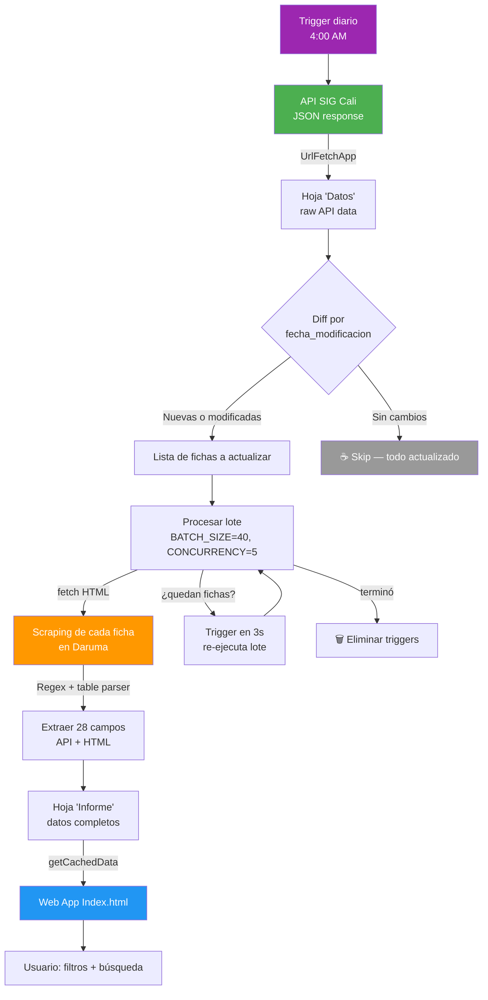

# Arquitectura Técnica — Manualito en Daruma

## Visión general

Sistema de búsqueda y consulta de manuales de funciones construido sobre **Google Apps Script** + **Google Sheets**. Combina datos de la API oficial del SIG de Cali con **web scraping** para extraer campos adicionales del HTML de cada ficha.

## Componentes

### 1. Script de Apps Script (`Code.gs`)

```
┌─────────────────────────────────────────────────┐
│  Apps Script (6 min max ejecución)              │
│                                                  │
│  ejecutarProcesoAutomatico()                     │
│  ┌─────────────────────────────────────────┐    │
│  │ 1. UpdateJson()                          │    │
│  │    API SIG → hoja "Datos"               │    │
│  └──────────────┬──────────────────────────┘    │
│                 ▼                                 │
│  ┌─────────────────────────────────────────┐    │
│  │ 2. iniciarProcesamientoFichas()          │    │
│  │    Compara fecha_modificación            │    │
│  │    → lista de fichas a actualizar (Δ)   │    │
│  └──────────────┬──────────────────────────┘    │
│                 ▼                                 │
│  ┌─────────────────────────────────────────┐    │
│  │ 3. procesarLoteFichasRapido()            │    │
│  │    BATCH_SIZE=40, CONCURRENCY=5          │    │
│  │    Si quedan fichas → trigger 3s         │    │
│  │    Si terminó → eliminarTriggers()        │    │
│  └─────────────────────────────────────────┘    │
│                                                  │
│  doGet() → Web App (Index.html)                  │
│  getCachedData() → lee hoja "Informe"            │
└─────────────────────────────────────────────────┘
```

### 2. Web App (`Index.html`)

Frontend vanilla HTML/JS. Carga datos vía `google.script.run.getCachedData()`.

### 3. Trigger diario

- **Función**: `ejecutarProcesoAutomatico`
- **Frecuencia**: Diaria a las 4:00 AM
- **Tipo**: Time-driven → Day timer → 4am

## Flujo de datos



```
API SIG Cali (JSON)
    │
    ▼
Hoja "Datos" (raw API response)
    │
    ▼ (diff por fecha_modificación)
    │
    ▼ (scraping HTML concurrente por lotes)
    │
Hoja "Informe" (28 columnas: API + scraping)
    │
    ▼
Web App (Index.html vía getCachedData())
    │
    ▼
Usuario final (filtros + búsqueda)
```

## Estrategia de scraping

### Limitaciones de Apps Script
- **6 minutos** máximo por ejecución
- **20 segundos** de tiempo de CPU por día
- **~20,000** operaciones de URL Fetch por día

### Solución: triggers encadenados
1. `iniciarProcesamientoFichas()` identifica fichas a procesar (incremental)
2. `procesarLoteFichasRapido()` procesa 40 fichas con concurrencia de 5
3. Si quedan fichas → crea un trigger que re-ejecuta en 3 segundos
4. El estado se persiste en `PropertiesService` y `CacheService`

### Parsing HTML
- **Regex** para campos de texto (Nivel, Decreto, Denominación, etc.)
- **Parser de tablas** (`<tr>/<td>`) para campos estructurados (Comunes, Formación)
- **Detección por numeración romana** para delimitar secciones (ii. Área funcional, iii. Proceso, iv. Propósito, etc.)

### Manejo de errores
- `fetchAllWithRetry()`: 3 intentos con backoff exponencial (4s, 8s, 12s) para errores 502/504
- `construirFilaError()`: registra fichas que fallaron para revisión manual
- `eliminarTriggersPrevios()`: limpia triggers colgados antes de cada ejecución

## Actualización incremental vs. forzada

| Modo | Función | Comportamiento |
|------|---------|----------------|
| **Incremental** (diario) | `ejecutarProcesoAutomatico()` | Solo scrapea fichas nuevas o con `fecha_modificación` cambiada |
| **Forzado** (manual) | `ejecutarProcesoForzado()` | Borra la hoja "Informe" y regenera todo desde cero |

## Configuración

| Variable | Descripción | Default |
|----------|-------------|---------|
| `SPREADSHEET_ID` | ID del spreadsheet de Google | — (requerido) |
| `SHEET_NAME` | Nombre de la hoja de resultados | `"Informe"` |
| `BATCH_SIZE` | Fichas por lote de procesamiento | `40` |
| `CONCURRENCY` | Requests simultáneos por chunk | `5` |
| `HEADERS_FICHA` | Columnas de la hoja "Informe" | 28 columnas |

## Optimización de performance

- **Renderización**: se limita a 500 filas en la tabla para no congelar el navegador
- **Cache**: `CacheService` almacena índices y extras por 6 horas (21,600 segundos)
- **Filtros en cliente**: el filtrado se hace en JavaScript (no en servidor) ya que los datos caben en memoria
